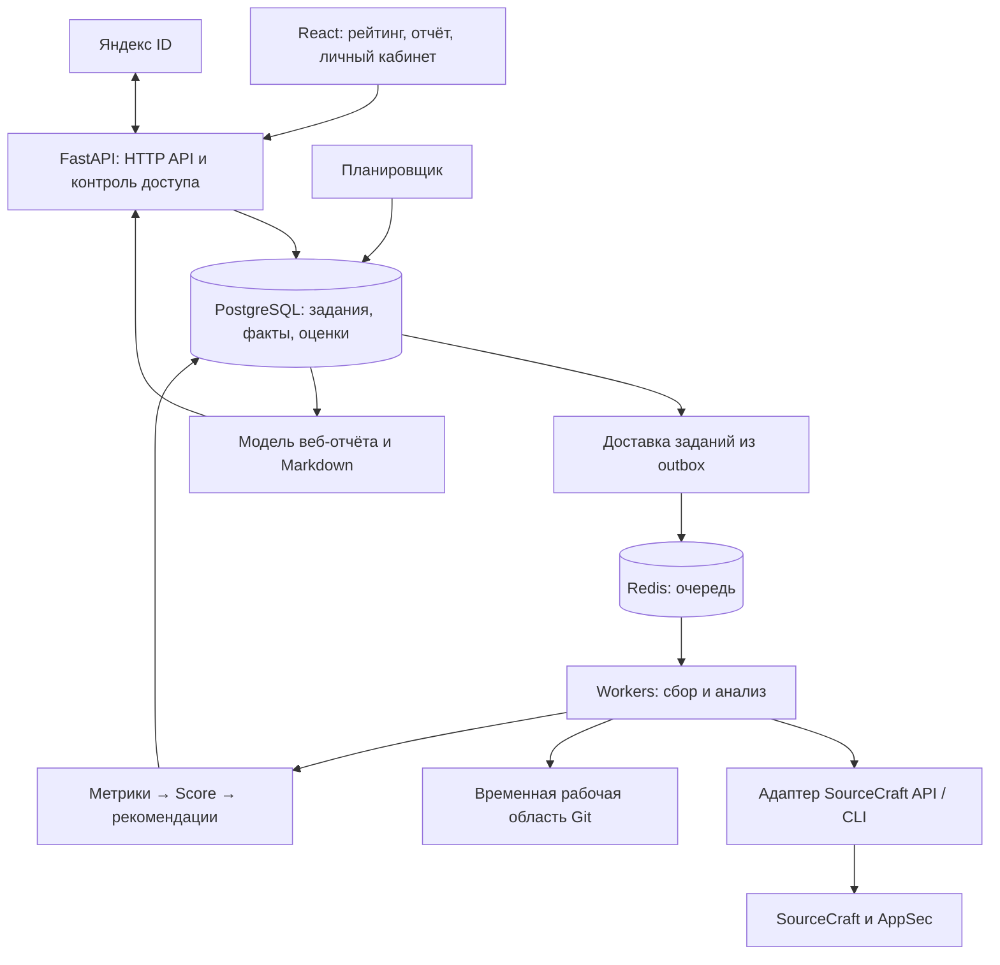

# SourceCraft Repo Health: предложение по архитектуре

Дата: 15 сентября 2026 года. Статус: предложение для обсуждения, до реализации.

Основание: техническое задание «8. Yandex Cloud.pdf», все 21 страница файла. Номера страниц ниже соответствуют напечатанным номерам документа: титульная страница не нумеруется. Исходного кода в рабочей папке на момент анализа нет.

Предположение: первая версия создаётся небольшой командой для хакатона с последующим развитием. Состав команды, бюджет, сроки, количество репозиториев и квоты API не заданы. Стек, интервалы и пороги ниже являются рекомендациями, а не требованиями ТЗ или подтверждёнными характеристиками производительности.

## 1. Основное решение

Рекомендую модульный монолит на Python с отдельно запускаемыми API, планировщиком и фоновыми обработчиками. У них общая кодовая база и модель данных, но разные процессы и лимиты ресурсов. Веб-запросы читают сохранённые результаты; анализ репозитория выполняется через очередь.

Базовый стек:

| Область | Предложение | Причина выбора |
| --- | --- | --- |
| Интерфейс | React, TypeScript, Vite | Рейтинг, фильтры, категории и статусы анализа; серверный рендеринг для MVP не требуется |
| HTTP API | FastAPI, Pydantic | Контракты запросов и ответов, интеграции, единый Python-код с аналитикой |
| Данные | PostgreSQL, SQLAlchemy, Alembic | Связи, транзакции, сортировка рейтинга, снимки метрик в JSONB |
| Фоновые задачи | Celery, Redis как брокер | Отдельные обработчики, повторные попытки, разделение коротких и тяжёлых работ |
| Расписание | Один экземпляр Celery Beat, задания в БД | Планировщик ставит задания; обработчики выполняют анализ |
| Исходники | Git и SourceCraft CLI в изолированном рабочем окружении | Анализ файлов и истории с ограничением времени и диска |
| Экспорт | Markdown из сохранённого результата | Полностью покрывает минимальное требование ТЗ; PDF можно добавить позже |
| Запуск | Linux-контейнеры, Docker Compose | Одинаковое окружение локально и на демонстрационном стенде |

Выбор Python мотивирован задачами извлечения и нормализации метрик. Если команда сильнее в TypeScript, равноценная альтернатива — NestJS + BullMQ; границы компонентов и данные остаются теми же. Фиксировать версии библиотек следует при создании проекта и сохранять lock-файлы.

Для тяжёлых вычислений и распределения задач по процессам документация FastAPI указывает на отдельные системы задач, включая Celery: [FastAPI Background Tasks](https://fastapi.tiangolo.com/tutorial/background-tasks/#caveat).

### Почему этот вариант

| Вариант | Преимущества | Компромиссы | Когда выбирать |
| --- | --- | --- | --- |
| **Модульный монолит + workers** | Быстрое сквозное решение, общие модели, независимое масштабирование анализа | Нужны очередь и дисциплина границ модулей | Рекомендуемый вариант для этого ТЗ |
| Монолит + очередь заданий в PostgreSQL | Меньше инфраструктуры | Нужно самостоятельно корректно реализовать аренду задания, heartbeat, retries и восстановление | Очень небольшой стенд или готовый опыт команды с такой очередью |
| Отдельные микросервисы для каждого анализатора | Независимые релизы и масштабирование | Больше сетевых контрактов, эксплуатационных задач и проблем согласованности | Несколько самостоятельных команд или измеренная необходимость изоляции |

Kubernetes, Kafka и отдельное аналитическое хранилище пока не дают достаточной пользы для обязательных сценариев. Начать можно с одного сервера; отделять workers и БД по мере измеренного роста нагрузки.

## 2. Требования ТЗ, определяющие архитектуру

| Требование | Раздел / страница ТЗ | Архитектурное следствие |
| --- | --- | --- |
| Шесть категорий анализа | 3.1, стр. 6–7 | Шесть независимых модулей метрик и единый контракт результата |
| Объяснимость и воспроизводимость | 3.2–3.3, стр. 7–8 | Версионирование правил, снимки входных фактов, ссылки на доказательства |
| «Нет данных» отличается от плохой оценки | 3.2, стр. 7; 11, стр. 15 | Статус доступности отдельно от числового значения |
| Security на реальных данных AppSec | 3.1, стр. 6 | Отдельный адаптер AppSec; собственный сканер не заменяет интеграцию |
| Публичный рейтинг, фильтры и сортировки | 4, стр. 9–10 | Предрассчитанная публичная проекция, индексы, пагинация |
| Я ID и собственные репозитории | 5, стр. 10 | Отдельные механизмы входа и проверки доступа к SourceCraft |
| Регулярный повторный анализ | 6, стр. 11 | Планировщик, устойчивые задания, обновление независимых источников |
| Крупные репозитории | 9.2, стр. 13 | Асинхронная обработка, лимиты ресурсов, отдельная очередь тяжёлых работ |
| Минимальное хранение исходного кода | 11, стр. 15 | Временные рабочие каталоги, хранение производных фактов |
| Markdown или PDF | 2, стр. 5; 3.4, стр. 9 | Единая модель отчёта; Markdown достаточно для первой версии |
| Рост охвата открытых проектов | 4, стр. 9 | Автоматическое обнаружение, учёт охвата и стоимости пересчёта |

Рабочий продукт и аналитика дают 65 из 100 основных баллов. Бонусные направления суммарно дают до 5 баллов и оцениваются после обязательных сценариев. Поэтому интеграция, методика и демонстрация повторного анализа должны предшествовать AI и сложной дополнительной аналитике.

## 3. Проверка возможностей SourceCraft

Проверены публичная документация и опубликованная JSON-спецификация. Авторизованные запросы к пользовательским репозиториям не выполнялись. Наличие описания метода не подтверждает доступность конкретных данных для выбранного токена.

### Подтверждено документацией

- REST API использует персональный токен PAT: [начало работы с API](https://sourcecraft.dev/portal/docs/ru/sourcecraft/operations/api-start).
- CLI поддерживает JSON; `src api` выполняет запросы к REST API и поддерживает пагинацию: [справочник команды](https://sourcecraft.dev/portal/docs/en/cli-ref/src-api).
- В JSON-спецификации описаны репозитории организаций, дерево файлов, CI runs, issues, pull requests, contributors, releases и профиль пользователя. В Repository есть язык, время обновления и агрегированный рейтинг реакций: [спецификация](https://api.sourcecraft.tech/sourcecraft.swagger.json).
- Рейтинг реакций содержит разные виды положительных реакций. Поле `rating.value` нельзя автоматически подписывать «количество лайков»; агрегат и счётчики нужно отображать с корректными названиями.
- Для SAST и secret scanning документирован экспорт SARIF через интерфейс: [SAST](https://sourcecraft.dev/portal/docs/en/sourcecraft/operations/sast), [secret scanning](https://sourcecraft.dev/portal/docs/en/sourcecraft/operations/secret-scan). Это подтверждает формат экспорта, но не готовый API для автоматического периодического сбора.

### Зависимости, которые надо проверить в первую очередь

В изученной спецификации я не обнаружил методов общего каталога всех открытых репозиториев, полного списка репозиториев текущего пользователя и чтения AppSec findings. Это ограничение проверки опубликованной спецификации, а не доказательство отсутствия таких интерфейсов на платформе.

| Зависимость | Проверка до основной реализации | Временное поведение |
| --- | --- | --- |
| Вход через Я ID → доступ SourceCraft | Уточнить поддерживаемый поток делегирования, права и связь идентификаторов | Вход через Я ID и отдельное подключение PAT как предлагаемый резервный UX |
| Перечень доступных пользователю репозиториев | Найти поддерживаемый метод списка организаций / репозиториев, проверить пагинацию и ACL | Список подключённых организаций с честно указанным ограничением охвата |
| Полный публичный каталог | Подтвердить интерфейс обнаружения, ограничения поиска и пагинацию | Начальная выборка + автоматически опрашиваемые известные организации |
| AppSec | Получить реальные SAST/SCA/secret результаты, статусы, время скана и права чтения | «Нет данных» с причиной; эта ветка не доказывает готовую Security-интеграцию |

CLI является альтернативным способом вызова поддерживаемых функций; сам по себе он не гарантирует доступ к отсутствующим данным. Методы управления CI-секретами не являются результатами secret scanning.

Результат первого этапа — матрица «метрика → источник → метод/команда → права → пагинация → доступность» с проверкой на реальных проектах. Если остаётся только ручной экспорт SARIF, можно проверить парсер и формулу, но нельзя объявлять автоматический пересчёт AppSec реализованным. Подтверждение допустимости резервного PAT-сценария и каналов AppSec необходимо получить у организаторов перед фиксацией финального UX.

## 4. Компоненты и потоки



Это схема процессов и зависимостей, а не набор отдельных микросервисов.

### Границы модулей

1. **Identity & Access.** Вход, сессии, подключения SourceCraft, проверка прав.
2. **Catalog.** Обнаружение проектов, метаданные, видимость, язык, реакции и время активности.
3. **Analysis Orchestration.** Запросы на анализ, расписание, стадии, повторы, дедупликация.
4. **SourceCraft Adapters.** REST/CLI, пагинация, преобразование ошибок, лимиты запросов.
5. **Collectors.** Сбор фактов из API и Git, минимизация сохраняемых данных.
6. **Metrics.** Шесть категорий; преобразование фактов в нормализованные показатели.
7. **Scoring.** Чистая функция от снимка метрик, версии правил и времени анализа.
8. **Recommendations.** Детерминированные правила, приоритеты, доказательства и ожидаемый эффект.
9. **Reports & Leaderboard.** Представления для интерфейса, экспорта и рейтинга.

Главный контракт: сборщики возвращают факты и качество данных. Они не назначают итоговый Score. Scoring не обращается к сети, Git или текущему системному времени.

## 5. Жизненный цикл анализа

1. API проверяет сессию, доступ к репозиторию и лимит пользовательских запусков.
2. В одной транзакции создаются `analysis_run` и запись outbox для доставки задания. Повтор запроса с тем же ключом возвращает существующее задание.
3. Отправитель доставляет идентификатор задания в очередь. Если доставка повторяется, результат не дублируется.
4. Worker получает ограниченную по времени аренду задания, проверяет права повторно и фиксирует `analysis_as_of` и commit SHA выбранной ветки.
5. Сборщики получают данные независимо: ошибка CI не прерывает документацию или issues. Соблюдаются общие квоты на токен и сервис.
6. Сохраняется снимок необходимых фактов с временными границами, статусами источников и хешем входов. API-данные разных подсистем не объявляются атомарным снимком: сохраняются времена получения и расхождения с commit SHA.
7. Метрики, Score и рекомендации рассчитываются из этого снимка.
8. После проверки полноты результат сохраняется атомарно. Указатель на опубликованный результат переключается только по правилам публикации и с проверкой, что более старый запуск не затрёт новый.
9. Пользователь видит результат, время, охват, предупреждения и ссылки на доказательства. Markdown использует тот же `analysis_id`.
10. Временные исходники удаляются. Дополнительный сборщик мусора убирает каталоги после аварий.

Статусы запуска: `queued → collecting → calculating → completed | partial | failed | cancelled`. Стадии каждого сборщика учитываются отдельно. Прогресс показывается по стадиям; точный процент допустим только при известном объёме работы.

На первой версии интерфейс может опрашивать `GET /analyses/{id}` раз в несколько секунд. SSE имеет смысл при необходимости более оперативных обновлений.

### Устойчивость

- PostgreSQL хранит состояние выполнения; Redis не является единственным местом хранения результата.
- Семантика доставки — возможные повторы. Повторяемость без побочных эффектов обеспечивают уникальные ключи этапов, аренды и транзакции публикации.
- HTTP timeout, 429 и временные 5xx имеют ограниченные повторы с увеличением задержки и случайным разбросом; учитывается `Retry-After`, если он предоставлен.
- 401/403 переводят подключение в состояние, требующее восстановления доступа; бесконечные повторы исключаются.
- Контроль heartbeat и просроченных аренд восстанавливает задания после остановки worker.
- Временная недоступность источника не стирает последний успешный отчёт. Новый частичный результат сохраняется отдельно с временем попытки.
- Окончательно неуспешные задания доступны для диагностики и контролируемого повторного запуска.

Параметры подтверждения и повторной доставки Celery требуют явной настройки; одной установки `acks_late` недостаточно для всех видов отказа: [документация Celery](https://docs.celeryq.dev/en/stable/userguide/tasks.html).

## 6. Модель данных

| Сущность | Основные данные |
| --- | --- |
| `users` | Внутренний ID, подтверждённый ID провайдера входа |
| `sourcecraft_connections` | Владелец, SourceCraft user ID, ссылка на зашифрованный секрет, срок и состояние доступа |
| `repositories` | SourceCraft ID, организация, slug, видимость, ветка, язык, реакции, активность, время проверки видимости |
| `repository_access` | Пользователь/подключение, репозиторий, время проверки доступа; это кэш, не вечное право |
| `analysis_runs` | Репозиторий, контекст доступа, инициатор, триггер, статус, SHA, версии правил, время, опубликованный результат |
| `collection_results` | Источник, статус, причина отсутствия, время получения, границы периода, полнота, ошибки, курсор |
| `metric_observations` | Код метрики, raw value, normalized value, единицы, знаменатель, статус, ссылки на evidence |
| `evidence` | Источник, идентификатор объекта, URL, SHA/путь/строка при наличии, минимальные необходимые факты, доступность для публикации |
| `category_scores` | Категория, оценка или null, исходный и фактический вес, полнота |
| `recommendations` | Правило, проблема, действие, приоритет, evidence, предпосылки и сценарный эффект |
| `outbox` | Задание для доставки, дата, количество попыток, статус доставки |
| `leaderboard_entries` | Только публичные поля опубликованного результата, Score, полнота, сортировочные поля |

Начать с обычных таблиц и ограниченного JSONB для неоднородных фактов. Не сохранять произвольные полные ответы API без оценки необходимости.

Индексы: публичный Score + ID, язык + Score + ID, рейтинг реакций + ID, активность + ID, репозиторий + время анализа, статус задания + время следующей попытки. Нужны устойчивые дополнительные ключи сортировки и пагинация.

Снимки запусков полезны уже для воспроизводимости. Полноценный график истории и сравнение версий методики остаются следующей функцией. При смене версии правил сначала пересчитать сопоставимую выборку или явно разделить рейтинг по версиям.

## 7. Метрики, отсутствие данных и Score

### Контракт метрики

Число отдельно от состояния. Рекомендуемые состояния:

- `measured` — значение получено; оно может быть нулевым и плохим.
- `unavailable` — источник или права недоступны.
- `not_applicable` — метрика обоснованно неприменима.
- `insufficient_sample` — наблюдений недостаточно для заявленного вывода.
- `error` — не удалось получить/обработать данные.

Свежесть и полнота — отдельные поля: `observed_at`, `freshness`, `sample_size`, `expected_size`, `truncated`, `reason_code`. Частично просмотренный список не считается полным нулевым результатом.

Примеры:

- README отсутствует в полностью прочитанном дереве нужного commit — измеренный факт.
- Запрос дерева завершился ошибкой — нельзя утверждать, что README отсутствует.
- История CI доступна, но запусков нет — частота успешных прогонов не определена; наличие конфигурации учитывается отдельно.
- Скан AppSec успешно завершился без находок — ноль найденных проблем в его области покрытия.
- Результаты AppSec недоступны или скан не выполнялся — это не «уязвимостей нет».
- Открытых issues нет — метрика возраста открытых issues неприменима, а не автоматические 100 баллов за работу с обращениями.

### Категории первой версии

| Категория | Приоритетные признаки | Ограничение интерпретации |
| --- | --- | --- |
| Документация | README, лицензия, запуск, тестирование, CONTRIBUTING, CODEOWNERS | Длина текста и само наличие файла не доказывают качество |
| CI/CD | Наличие конфигурации, результаты завершённых прогонов, повторяющиеся сбои | Отменённый/ещё выполняющийся прогон не равен неуспешному; длительность без контекста не штраф |
| Security | Реальные открытые AppSec findings по критичности, статусы исправления, покрытие сканов | Не смешивать недоступность, отсутствие скана, false positive и подтверждённое отсутствие находок |
| Активность | Давность содержательной активности, активные недели, contributors, MR и релизы | Большой поток коммитов не должен безгранично повышать оценку; зрелый стабильный проект может меняться редко |
| Issues | Возраст и доля зависших открытых задач, динамика обработки | Число открытых задач само по себе не показатель плохого здоровья |
| Code health | TODO/FIXME в комментариях, доля затронутых файлов, возраст при доступной истории | Исключать generated/vendor и бинарные файлы; TODO — слабый признак, удаление комментария не доказывает устранение долга |

Время первого ответа и закрытия можно добавить при наличии данных, но расширенную аналитику обработки issues разумно отложить до работающего обязательного сценария.

### Предлагаемая основа формулы

Для каждой метрики задаются нормализатор в диапазон 0–100, вес внутри категории и условия применимости. Параметры сохраняются как версия методики. Для доступных метрик категории считается взвешенное среднее; затем аналогично объединяются категории:

```text
Category_i = sum(a_ij * Metric_ij для доступных j)
             / sum(a_ij для доступных j)

Score_base = sum(w_i * Category_i для доступных i)
             / sum(w_i для доступных i)
```

При пустом знаменателе результат `null`, в UI — «Нет данных». Промежуточные значения не округляются; правило финального округления фиксируется в версии методики. Исключённые веса и фактический вклад каждой метрики видны в объяснении.

Как исходный вариант предлагаю веса: Security 25%, CI/CD 20%, документация 20%, активность 15%, issues 15%, code health 5%. Они отличаются от необязательного примера ТЗ: первичная Code health на TODO/FIXME слишком косвенная, чтобы определять 20% результата. Увеличивать её вес следует после появления и проверки более сильных метрик.

Простого среднего недостаточно для критических рисков. Предлагаю отдельно проверить правило ограничения итоговой оценки при подтверждённой открытой критической проблеме AppSec, например `Score = min(Score_base, 60)`. Это кандидат для калибровки, не готовый эталон: порог и конкретные статусы надо проверить на контрольных сценариях и всегда показывать причину ограничения.

Порядок severity, условия снятия ограничения и обработка false positive должны быть заданы явно. Отсутствие AppSec не активирует штраф или ограничитель.

### Полнота и сопоставимость

Рядом со Score показывать покрытие ожидаемых данных. Для метрики коэффициент полноты `q_ij` задаётся контрактом сбора: 1 для достаточного покрытия, 0 для отсутствия, промежуточное значение только при обоснованном измерении. При неизвестном объёме нельзя придумывать точный процент.

```text
Coverage = sum(w_i * a_ij * q_ij) / sum(w_i * a_ij)
```

Внутренние веса `a_ij` нормированы в каждой категории. Знаменатель учитывает заранее определённый применимый набор; недоступность источника не является причиной объявить его неприменимым.

Не умножать Score на Coverage: это превратит отсутствие данных в штраф. Например, 90/100 при 20% покрытия должно иметь заметную пометку предварительной оценки; его нельзя представлять как столь же подтверждённое качество, что 85/100 при полном покрытии.

Каталог сохраняет все обнаруженные публичные проекты, включая непроанализированные. Предлагаемое правило для сопоставимых мест рейтинга — отдельная группа результатов с достаточным покрытием и единой версией методики; частичные результаты остаются доступными с сортировкой и пометками. Порог покрытия и требования к Security нужно выбрать после проверки реального охвата, чтобы правило не сделало основной рейтинг пустым. Это продуктовое решение для согласования, а не требование ТЗ.

Лайки не входят в Score. Сортировки по реакциям и активности доступны как альтернативные режимы просмотра; исходный порядок определяется здоровьем.

### Рекомендации

Правило возвращает проблему, важность, конкретное действие, приоритет и ссылки на evidence. Например, сбои в нескольких последних завершённых CI-прогонах дают рекомендацию с номерами этих прогонов.

Предлагаемые приоритеты: P0 — подтверждённая критическая проблема безопасности; P1 — существенный устойчивый сбой; P2 — улучшение сопровождаемости; P3 — малозначимое улучшение. Конкретные условия хранятся рядом с правилами метрик.

Ожидаемый прирост считается повторным запуском той же формулы со сценарием исправления при том же покрытии и времени анализа. Если нельзя выразить изменение числами, выводится качественный эффект. Независимые оценки прироста нельзя безусловно складывать: рекомендации могут влиять на одну метрику или снимать общий ограничитель.

LLM возможна позднее для формулировки краткого обзора по готовым фактам. Источником чисел, приоритетов и подтверждений остаётся детерминированный расчёт.

## 8. Авторизация и защита данных

### Вход и доступ к репозиторию

Яндекс ID отвечает за установление личности пользователя нашего сервиса. Предлагаемый поток — Authorization Code, серверный обмен кода, проверка `state`, PKCE при поддержке выбранной конфигурацией и защищённая серверная сессия. Возможности параметров описаны в [документации Яндекс ID](https://yandex.ru/dev/id/doc/ru/codes/code-url).

Доступ SourceCraft оформляется отдельным подключением. Сначала проверяется поддерживаемое делегирование. Резервный вариант — подключение PAT после входа. Токен проверяется через профиль SourceCraft и привязывается к внутреннему пользователю; по email аккаунты автоматически не объединяются. Этот UX требует проверки совместимости с ожиданиями организаторов.

### Границы публикации

- Проверять доступ при запуске, получении отчёта, экспорте и перед продолжением закрытого анализа.
- Контекст доступа входит в ключи кэша, заданий и снимков. Пользовательские расширенные факты не попадают в публичную проекцию даже для публичного репозитория.
- Public worker и пользовательские workers используют разные подключения; публичный рейтинг включает только явно разрешённые к раскрытию факты.
- Публичность кода не доказывает публичность всех AppSec и организационных данных. Публикация таких полей требует отдельно подтверждённой политики доступа источника.
- Приватные отчёты выдаются после проверки прав, без общего CDN-кэша. Если источник проверки прав недоступен и нет действующей короткой аренды доступа, выдача закрытых данных блокируется.
- Изменение репозитория на private удаляет публичную проекцию и её кэш при следующем подтверждении. Максимальное окно между изменением и обнаружением задаётся TTL проверки; более строгая гарантия требует проверки при чтении или надёжного события от платформы.
- PAT и прочие секреты хранятся зашифрованно, ключи отдельно. Токены не передаются в браузер после подключения и не включаются в логи, URL и аргументы внешней команды.

### Анализ недоверенного кода

Worker читает файлы и Git-историю; запуск сборки, тестов и скриптов анализируемого проекта для базовых метрик не нужен. Рабочее окружение имеет лимиты памяти, диска, времени и разрешённых сетевых адресов. Submodules, LFS и внешние Git-фильтры не загружаются автоматически.

Проверять адреса репозиториев, перенаправления, пути файлов и символические ссылки. CLI вызывать списком аргументов без shell-интерполяции. Для каждой задачи используется изолированная конфигурация CLI. Текст секретов из AppSec не сохраняется; достаточно типа, статуса, идентификатора и разрешённой ссылки.

## 9. Большие репозитории и регулярный пересчёт

В ТЗ крупный репозиторий удовлетворяет хотя бы одному условию: **10 000 отслеживаемых файлов, 20 000 коммитов или 500 МБ рабочей копии**. Это граница демонстрационной проверки, а не максимальный допустимый размер.

### Стратегия обработки

1. Сначала получить метаданные и зафиксировать SHA; API списки обходить постранично.
2. Обрабатывать дерево и текстовые файлы потоково, не читать всю рабочую копию в память.
3. Для метрик содержимого переиспользовать результаты по blob hash и версии анализатора. Для приватных данных кэш ограничен контекстом доступа и сроком хранения.
4. Git-данные получать в необходимом объёме. Partial/shallow clone использовать при поддержке сервера и совместимости с метрикой; предусмотреть обычное ограниченное получение.
5. Возраст TODO нельзя достоверно вычислить по неполной истории. Дополнительную историю получать адресно и с бюджетом; иначе явно показывать ограничение возраста.
6. CI, issues, релизы, права, AppSec и временные метрики обновлять даже при неизменном SHA. Git-кэш не заменяет пересчёт внешних источников.
7. Большие задания помещать в отдельную очередь и ограничивать их параллелизм, чтобы они не задерживали все пользовательские анализы.
8. При превышении бюджета сохранять частичный результат и объём обработанных данных. Для зачёта поддержки больших репозиториев одного немедленного timeout недостаточно — нужен содержательный демонстрируемый анализ.

### Предлагаемое расписание

- Обычные публичные проекты — раз в 24 часа.
- Активные проекты — раз в 6 часов, если позволяют квоты.
- Давно неактивные — раз в 72 часа, с отдельным обновлением видимости.
- Запуск пользователем — более высокий приоритет с ограничением частоты.
- Повтор после временной ошибки — отдельная задержка, независимо от регулярного расписания.

Планировщик использует `next_analysis_at` в БД и распределяет задания во времени. Webhooks можно добавить как ускоритель после подтверждения поддержки; периодическое обновление сохраняется.

### Масштабирование и измерения

API масштабируется по HTTP-нагрузке, workers — по возрасту очереди и времени обработки. После одного сервера следующий шаг — выделенный пул workers и отдельная PostgreSQL. История большого объёма может перейти в объектное хранилище; для Markdown MVP оно необязательно.

Для оценки пропускной способности измерять среднее время анализа `t`, число запросов `r` на проект, число параллельных заданий `C` и реальную квоту `L` запросов в секунду:

```text
Нижняя оценка длительности обхода N проектов ≈ max(N*t/C, N*r/L)
```

Это оценка без накладных расходов и разброса размеров, не обещание SLA. Нужны также p95 времени обработки, расход диска и память на больших проектах.

Минимальная эксплуатационная наблюдаемость: размер и возраст очередей, времена стадий, ошибки и 429 источников, доля partial, полнота данных, свежесть рейтинга, ошибки доставки outbox. Логи связаны `analysis_id`; персональные данные и секреты исключены.

## 10. Контракт собственного API

Это предлагаемые маршруты нашего приложения, не пути SourceCraft API.

| Метод | Маршрут | Назначение |
| --- | --- | --- |
| GET | `/api/v1/leaderboard` | Публичный рейтинг, язык, сортировка, пагинация, полнота |
| GET | `/api/v1/repositories/{id}` | Карточка репозитория и текущий доступный результат |
| POST | `/api/v1/repositories/{id}/analyses` | Проверка прав, постановка задания, ответ 202 и ID |
| GET | `/api/v1/analyses/{id}` | Статус и результат конкретного запуска |
| GET | `/api/v1/analyses/{id}/report.md` | Markdown по тому же снимку с проверкой доступа |
| GET | `/api/v1/me/repositories` | Доступные пользователю проекты в подтверждённом охвате подключения |
| POST | `/api/v1/connections/sourcecraft` | Подключение SourceCraft и проверка учётных данных |
| DELETE | `/api/v1/connections/{id}` | Отзыв подключения и прекращение зависимых работ |
| GET | `/auth/yandex/start` | Начало входа |
| GET | `/auth/yandex/callback` | Обработка ответа провайдера |

Внутренний API интерфейса нужен в обязательной версии. Отдельно документированный внешний API, гарантии совместимости и README badge относятся к расширению со звёздочкой.

## 11. Предлагаемая структура проекта

```text
repo_health/
  frontend/
    src/
      pages/
      features/leaderboard/
      features/repository-report/
      features/analysis-status/
      features/account/
  backend/
    app/
      api/
      identity/
      catalog/
      analysis/
      integrations/sourcecraft/
      collectors/
      metrics/
        documentation.py
        cicd.py
        security.py
        activity.py
        issues.py
        code_health.py
      scoring/
      recommendations/
      reports/
      infrastructure/
      worker.py
      scheduler.py
    migrations/
    tests/
      scoring_scenarios/
      integration/
      access/
  infra/
    compose.yaml
  docs/
    architecture-proposal.md
    sourcecraft-capabilities.md
    scoring-methodology.md
    demo-runbook.md
```

Эта структура предлагается; кроме настоящего документа перечисленные файлы ещё не созданы. Модули выделяются по ответственности без создания одинаковых слоёв и абстракций вокруг каждой маленькой функции.

## 12. Порядок реализации и приёмка

### Этап 0. Проверить внешние зависимости

- Подтвердить аутентификацию, доступ к собственному проекту и выбор репозитория.
- Получить живые CI, issues и AppSec данные; проверить пагинацию, пустые данные и ошибки.
- Подтвердить путь автоматического расширения публичного каталога.

Выход: матрица возможностей, реальные обезличенные примеры контрактов для тестов и список ограничений. Если критические интерфейсы не подтверждены, это видно до разработки интерфейса.

### Этап 1. Сквозной анализ одного публичного проекта

Постановка задания → сбор → шесть категорий с честными статусами → Score → рекомендации → веб-отчёт → Markdown. Параллельно формируется методика v1 и сценарии её проверки.

### Этап 2. Все обязательные пользовательские пути

Рейтинг и сортировки, фильтр языка, вход через Я ID, собственные репозитории, ограничение доступа, повторный запуск, расписание и восстановление после ошибки.

### Этап 3. Охват, крупные проекты и демонстрация

Автоматическое обнаружение проектов, отдельная очередь тяжёлых задач, измерения на большом репозитории, воспроизводимый запуск, инструкция и сценарий демонстрации. Обновление рейтинга и экспорт проверяются на одном и том же снимке.

### Этап 4. Бонусные возможности

Сначала история/сравнение и badge: их проще построить на сохранённых снимках и готовых отчётах. Затем review/bus factor и AI-summary при наличии времени. Продвинутая защита от накрутки развивается отдельно от базовой устойчивости формулы.

### Критерии проверки архитектуры

1. Повторный расчёт на идентичных фактах, времени и версии даёт идентичный результат.
2. Контрольные сценарии по всем шести категориям показывают логичное влияние проблем и исправлений; слабые сигналы не доминируют.
3. Отсутствие AppSec и успешный скан без проблем дают разные состояния.
4. Остановка worker, повторная доставка и перезапуск брокера не создают дубли опубликованных результатов и не теряют задания из БД.
5. Частичный сбой источника не скрывает последний успешный отчёт и не изображается улучшением здоровья.
6. Изменение issues/CI или истечение времени учитывается при неизменном Git SHA.
7. Пользователь без доступа не получает закрытые данные через отчёт, экспорт, кэш, фоновые статусы или угадывание ID.
8. Отзыв подключения и переход проекта в private отражаются в выдаче согласно явно описанному сроку проверки прав.
9. Публичный отчёт не содержит фактов, полученных исключительно за счёт дополнительных пользовательских прав.
10. На реальном большом репозитории SourceCraft подтверждены размер, полезный результат, время, память и ограничения анализа.
11. Веб-отчёт и Markdown совпадают по `analysis_id`, числам, причинам пропусков и версии формулы.
12. Регулярный запуск подтверждён конфигурацией и первым/повторным анализом, как допускает ТЗ.

Эти проверки предложены для реализации. Сейчас выполнены изучение ТЗ и проверка публичных описаний интерфейсов; приложение, нагрузочные испытания и авторизованные интеграционные проверки ещё не выполнялись.

## 13. Решения, которые предстоит зафиксировать

1. Основной язык команды: предложенный Python или TypeScript-вариант.
2. Поддерживаемый поток Я ID / SourceCraft и допустимость отдельного подключения PAT.
3. Реальные методы получения AppSec и полного каталога.
4. Калиброванные метрики, веса, критические ограничения и правило сопоставимости частичных оценок.
5. Периодичность, квоты, бюджет ресурсов и сроки хранения фактов / временного кода.

Эти вопросы не препятствуют выбору общей архитектуры. Самые дорогие ошибки здесь связаны с предположениями о доступности данных и смешением частичных результатов с подтверждёнными оценками. Поэтому первый практический шаг — короткая проверка интеграций, после неё — сквозной анализ одного репозитория.
